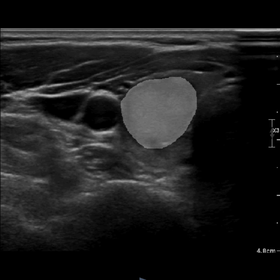

# [阿里天池-甲状腺B超静态及动态影像算法赛](https://tianchi.aliyun.com/competition/entrance/532255)
## 团队信息
1. 团队名称：tc-77861803
2. 队员：胡太维
3. 最终名次：3 (二等奖)

## 项目概述
阿里天池-甲状腺B超静态及动态影像算法赛複赛原始码，共分为割与分类两个模型，分割模型对甲状腺结节区域分割、分类模型判断结节为阴性或阳性，分割模型使用 **EMCAD_b2**，分类模型使用 **pvt_b2**。



## 目录结构
```bash
天池竞赛/
├── README.md
├── Dockerfile
├── checkpoints/
│   ├── cls
│   ├── seg
├── configs/
│   ├── EMCAD_b2.yaml
│   ├── pvt_b2.yaml
├── tools/
│   ├── train_cls.py
│   ├── inference_cls.py
│   ├── train_seg.py
│   ├── inference_seg.py
├── src/
│   ├── hook/
│   ├── model/
│   ├── optimizer/
│   ├── transform/
│   ├── dataset.py
│   ├── iter_hook.py
│   ├── logger_helper.py
│   ├── loss.py
│   ├── metric.py
│   ├── registry.py
│   ├── trainer.py
│   ├── tta.py
│   ├── utils.py
├── requirements.txt
```
- **README.md**: 
  - 项目简介和使用说明

- **Dockerfile**: 
  - 用于创建项目的Docker镜像的配置文件。定义了如何构建项目的运行环境，包括所需的操作系统、依赖包和配置。

- **checkpoints/**: 
  - 存放训练好的模型文件，执行结束后，底下会产生 `cls/` 与 `seg/` 两个文件夹，分别存放分类与分割模型。

- **configs/**: 
  - 训练、推理阶段的配置文件。
    - **EMCAD_b2.yaml**: 分割模型训练、推理阶段的配置文件。
    - **pvt_b2.yaml**: 分类模型训练、推理阶段的配置文件。

- **tools/**: 
  - 模型训练与模型推理的进入点。
  - **train_cls.py**:
    - 用于训练分类模型的启动脚本。包括数据加载、分类模型定义、训练过程和模型保存等功能。
  - **train_seg.py**:
    - 用于训练分割模型的启动脚本。包括数据加载、分割模型定义、训练过程和模型保存等功能。
  - **infenrece_cls.py**:
    - 用于分类模型推理的启动脚本。包括数据加载、分类模型加载、推理结果保存等功能。
  - **inference_seg.py**:
    - 用于分割模型推理的启动脚本。包括数据加载、分割模型加载、推理结果保存等功能。

- **src/**: 
  - 项目的源代码目录，包含训练、推理和辅助功能的脚本。

  - **hook/**: 
    - 定义训练过程的钩子模组。

  - **model/**: 
    - 定义模型的模组。

  - **optimizer/**: 
    - 定义优化器的模组。

  - **transform/**: 
    - 定义数据转换的模组。

  - **dataset.py**: 
    - 定义数据集的模组。

  - **iter_hook.py**: 
    - 定义每步训练动作的模组。
  
  - **loss.py**: 
    - 定义损失函数的模组。

  - **metric.py**: 
    - 定义评估指标的模组。

  - **registry.py**: 
    - 定义註册器的模组。

  - **registry.py**: 
    - 定义训练器的模组。

  - **tta.py**: 
    - 定义 **Test-Time Augmentation** 的模组。

- **requirements.txt**: 
  - 项目依赖的Python包列表。

## 下载预训练权重
1. 请通过以下指令下载预训练权重
   ```
   mkdir pretrained/
   wget -O pretrained/pvt_v2_b2.pth https://travisergodic-ai-models.oss-cn-shanghai.aliyuncs.com/tianchi_thyroid/pvt_v2_b2.pth
   ```

## 使用方法
1. **train_cls.py**: 训练分类模型
   - `config_file`: 训练所需的配置文件。
   - `csv_path`: 标籤的 csv 路径，必须包含 `case` 与 `prob` 两个栏位。
   - `test_size`: 训练测试分割时，测试集的数量。
   - `image_dir`: 图像路径。
   - `n_epochs`: 训练的轮数。
   - `monitor`: 追踪指标，训练阶段，会根据此指标储存最佳模型 `best.pt`，必须确保此指标在配置文件中的 `METRICS` 出现。
   - `save_freq`: 模型储存的频率。
   - `bs`: 训练批次大小。
   - `lr`: 学习率。
   - `optim`: 优化器。
   - `weight_decay`: weight decay 正则参数大小。
   - `weight`: 载入的模型权重。

2. **train_seg.py**: 训练分割模型，参数同 **train_cls.py**。
3. **infernce_cls.py**: 分类模型推理。
   - `config_file`: 训练所需的配置文件。
   - `image_dir`: 图像路径。
   - `weight`: 载入的模型权重。
   - `bs`: 推理批次大小，因推理阶段使用 `cls_multipatch` 的 Test-Time Augmentation，仅支援 `bs=1` 的处理。 

4. **infernce_seg.py**: 分割模型推理。
   - `config_file`: 训练所需的配置文件。
   - `image_dir`: 图像路径。
   - `weight`: 载入的模型权重。
   - `threshold`: 像素分类的阈值。
   - `bs`: 推理批次大小。

5. **count_parameters.py**: 计算模型总参数量。